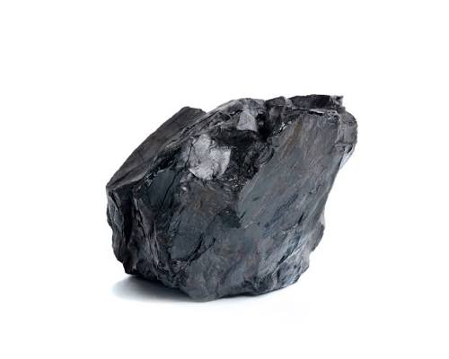

# ✂️ PaperTear Studio • Neubrutalism Torn Paper Cutter

> Một công cụ web cắt hiệu ứng xé giấy chân thực (Realistic Torn Paper Effect) với phong cách thiết kế **Neubrutalism** độc đáo.



---

## ✨ Tính năng nổi bật

- 🎨 **Phong cách Neubrutalism thời thượng**: Giao diện đậm chất đồ họa với viền đậm, bóng dập nổi (hard drop shadow), tone màu neon nổi bật.
- ✂️ **2 Chế độ cắt Lasso thông minh**:
  - **✏️ Tự do (Freehand)**: Vẽ đường bao quanh tùy thích bằng chuột hoặc touchpad.
  - **📐 Gấp khúc (Polygon)**: Cắt theo các điểm góc đa giác sắc cạnh, chính xác.
- 🎛️ **Tùy biến hiệu ứng xé giấy chi tiết**:
  - **Độ gợn sóng xé (Roughness)**: Điều chỉnh biên độ gồ ghề của mép giấy xé tự nhiên bằng Simplex/Perlin Noise.
  - **Độ rộng viền trắng (Base Border)**: Tùy chỉnh độ dày mép lộ ruột giấy trắng khi xé.
  - **Biến thiên viền (Border Variation)**: Tạo độ ngẫu nhiên lồi lõm chân thực cho viền giấy.
  - **Lông tơ xơ giấy (Paper Fibers)**: Mô phỏng các sợi tơ xơ vụn của bột giấy.
  - **Tông màu đế giấy (Paper Tint)**: Trắng tự nhiên, giấy báo cổ điển, trắng tinh khiết, bìa kraft xi măng.
  - **Bóng đổ 3D (Drop Shadow)**: Hiệu ứng nổi 3D đa chiều trên canvas.
- 📥 **Xuất ảnh chất lượng cao**: Xuất kết quả định dạng PNG trong suốt (Transparent PNG), dễ dàng ghép vào thiết kế, banner, poster, thumbnail YouTube/TikTok.

---

## 🛠️ Công nghệ sử dụng

- **HTML5 & Canvas API**: Xử lý đồ họa đa giác, clipping mask, thuật toán render hiệu ứng xé giấy bằng Noise Procedural.
- **CSS3 (Vanilla CSS)**: Thiết kế Neubrutalism hiện đại, responsive.
- **JavaScript (ES6+)**: Xử lý tương tác mượt mà không phụ thuộc thư viện bên ngoài (Zero-dependency).
- **Fonts**: [Be Vietnam Pro](https://fonts.google.com/specimen/Be+Vietnam+Pro) & [JetBrains Mono](https://fonts.google.com/specimen/JetBrains+Mono).

---

## 🚀 Hướng dẫn cài đặt & Chạy

Dự án hoàn toàn chạy trên trình duyệt (client-side), không cần backend:

1. **Clone repository**:
   ```bash
   git clone git@github.com:davenguyen-learn/paper-tear.git
   cd paper-tear
   ```

2. **Khởi chạy**:
   - Mở trực tiếp tệp `index.html` trên trình duyệt bất kỳ (Chrome, Edge, Safari, Firefox).
   - Hoặc sử dụng extension **Live Server** trên VS Code / Web Server cục bộ:
     ```bash
     npx serve .
     ```

---

## 📂 Cấu trúc thư mục

```
paper-tear/
├── assets/
│   └── sample.png          # Ảnh mẫu minh họa
├── css/
│   └── style.css           # Toàn bộ hệ thống giao diện Neubrutalism
├── js/
│   ├── app.js              # Khởi tạo giao diện, sự kiện UI, modal & export
│   ├── noise.js            # Thuật toán Simplex Noise cho viền xé tự nhiên
│   └── paper-tear.js       # Thuật toán cắt & render hiệu ứng xé giấy
├── index.html              # Trang ứng dụng chính
├── image.png
└── README.md
```

---

## 📄 Bản quyền & Giấy phép

Phát triển bởi **davenguyen-learn**. Dự án phát hành theo giấy phép MIT.
